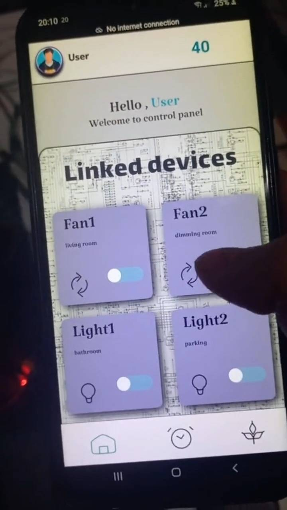
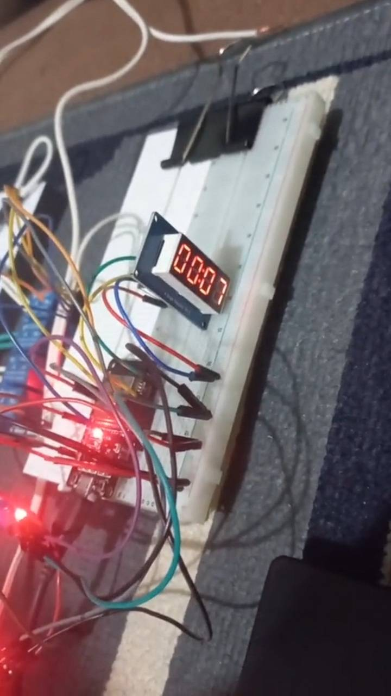
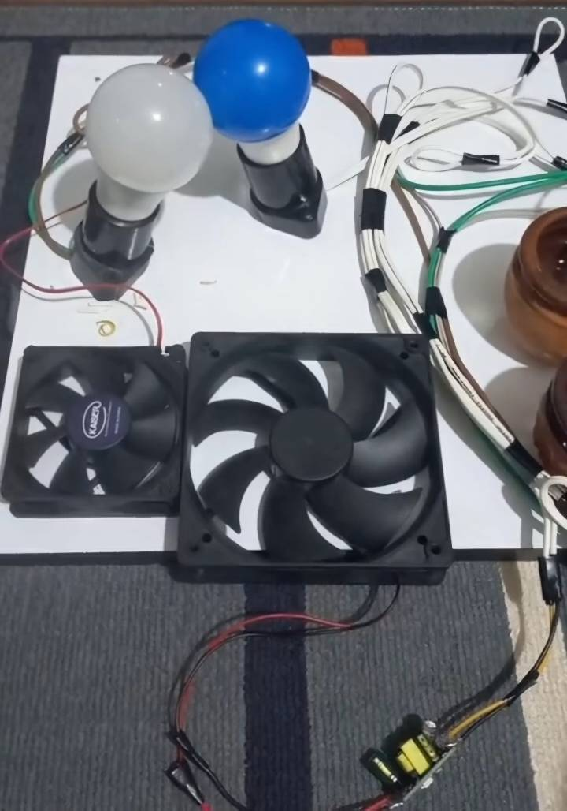

# 🌱 ESP32 Smart Plant & Device Controller

A tiny-but-mighty IoT system powered by an ESP32 that controls **lamps, fans, a water pump**, and reads **soil moisture** — all from a clean web interface hosted directly on the board. Yes, your plants now have Wi-Fi. You're welcome.

---

## 🚀 What This Project Does
- Turn ON/OFF 2 × lamps and 2 × fans  
- Run countdown timers that lock devices while running  
- Show live time on a TM1637 display  
- Read moisture levels from two sensors  
- Water your plants with a pump (responsibly… hopefully)  
- Serve 3 pages of HTML/CSS/JS from LITTLEFS  
- Make your ESP32 feel like a tiny web server with big dreams  

---

## 🧩 Pages Included
| Page | Description |
|------|-------------|
| **Control Panel** | Toggle lamps & fans like a boss |
| **Timer Manager** | Pick a device, set a timer, lock everything |
| **Moisture Monitor** | Check soil → decide if it deserves water |

---

<table>
  <tr>
    <td>
      
    </td>
    <td>
      
    </td>
     <td>
      
    </td>
  </tr>
</table>
## 🛠 Tech Stack
- ESP32 (Access Point mode)  
- Arduino C++  
- ESPAsyncWebServer  
- LITTLEFS filesystem  
- TM1637 4-digit display  
- Relays, moisture sensors, pump, fans  

---

## 📦 Installation

Required Arduino libraries:

ESPAsyncWebServer

AsyncTCP

LITTLEFS (ESP32)

TM1637

Flash LITTLEFS → Upload code → Enjoy IoT domination.

/data
   /css
   /scripts
   /backgrounds
   home_index.html
   time_index.html
   home_index2.html

src/
   main.ino
-----------------------------------------------------------------------
🔌 Useful Endpoints (for nerds)

/status1 … /status4 — Read last states

/lamp?output=x&state=y — Toggle device

/lockTimeStatus — Timer lock system

Moisture & pump endpoints depending on your setup

🔮 Future Ideas

Water level sensing (saving pumps since 2025)

Auto-watering logic

Temperature & humidity monitoring

Cloud dashboard

More chaos, more features

👨‍💻 Author

GitHub: https://github.com/Farzad2099

Note: This project was built for learning and experimentation purposes.
